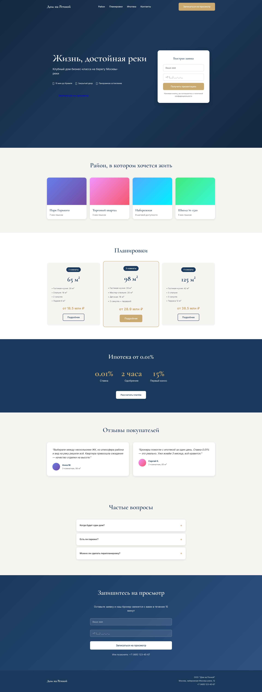
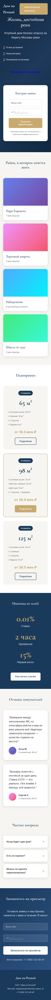
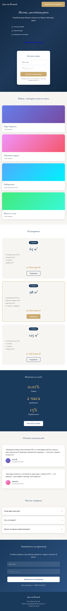

# Лендинг премиум-класса для агентства недвижимости «Дом на Речной»

## Название проекта и клиент

**Клиент:** АН «Дом на Речной» (Москва, премиальный сегмент жилой недвижимости)  
**Роль:** Веб-дизайнер, UI/UX-дизайнер, арт-директор проекта  
**Срок:** 6 недель (исследование + дизайн + сборка)  
**Год:** 2024

---

## Задача

Создать высококонверсионный лендинг для презентации клубного дома бизнес-класса на берегу Москвы-реки. Целевая аудитория — состоятельные покупатели 35–55 лет, ищущие primary real estate в закрытых комплексах.

**KPI:**
- CTR на форму заявки > 4%
- Время на сайте > 3 мин
- Bounce rate < 35%
- Цена лида < 8 000 ₽

---

## Мой подход

### Исследование
- **Глубинные интервью:** 5 интервью с потенциальными покупателями + 3 с брокерами компании
- **Конкурентный анализ:** разобрал 12 лендингов конкурентов (Level Group, ФСК, MR Group) — выделил паттерны доверия и боли
- **CJM:** построил карту пути клиента от рекламы до записи на просмотр

**Ключевой инсайт:** покупатель премиальной недвижимости принимает решение не от фотографий квартиры, а от «вайба района» и ощущения причастности к закрытому сообществу.

### UI/UX-решения
- **Структура:** Hero → Район → Планировки → Ипотека 0.01% → 3D-тур → Отзывы → FAQ → CTA
- **Принцип «один экран — одна мысль»:** никаких стен текста, информация дозирована
- **Social proof на каждом экране:** числа, лицензии, реальные фото брокеров
- **Микровзаимодействия:** hover-эффекты на карточках планировок, плавные переходы между секциями

---

## Что делал в Figma

### Дизайн-система
Создал масштабируемую систему из 62 компонентов:
- **Цвета:** 12 семантических токенов (Primary — `#1A3A5C`, Accent — `#C9A96E`, Background — `#F7F5F2`)
- **Типографика:** 6 уровней заголовков + 3 варианта body (Inter + Cormorant Garamond для акцентов)
- **Тени и скругления:** 4 варианта elevation для карт
- **Сетка:** 12-колоночная, gutter 24px, margin 80px desktop / 20px mobile

### Auto Layout и компоненты
- **Все компоненты на Auto Layout:** кнопки растягиваются по контенту, карточки адаптируются под длину текста
- **Варианты (Variants):** 5 состояний кнопки, 3 размера карточек планировок, светлая/темная тема секций
- **Properties:** логические свойства для быстрого переключения иконок и состояний

### Нейросети в работе
- **Midjourney v6:** сгенерировал 8 иллюстраций районной инфраструктуры (парк, набережная, школа, торговый квартал). Промпт: *"Aerial view of modern riverside residential district, golden hour, soft shadows, photorealistic, architecture photography"*
- **Stable Diffusion XL:** создал 12 иконок преимуществ в едином стиле (line art + золотой акцент). Инпейнтинг для сохранения консистентности штриха
- **Upscaling:** Real-ESRGAN 4x+ для печати баннеров и ретины

### Прототипирование
- Интерактивный прототип на 18 экранов с переходами Smart Animate
- Тестировал на пользователях через Maze — внес 23 правки по heatmap

---

## Сборка в Tilda

### Zero Block
- **100% секций на Zero Block** — полный кастомный дизайн без стандартных блоков
- **Грид-система:** ручная настройка сеток для desktop (1920px), tablet (768px), mobile (375px)
- **Слоистость:** использовал z-index для параллакса (фоновые слои движутся медленнее контента)

### Адаптив
- **3 брейкпоинта:** desktop, tablet, mobile
- **Порядок контента:** перестроил сетку планировок с 3-колоночной на вертикальный стек
- **Типографика:** масштабирование заголовков — H1 с 72px до 40px
- **Изображения:** srcset для ретины, WebP-формат, lazy loading

### Анимации
- **Появление элементов:** fade-up с задержкой 0.1s (stagger для списков)
- **Parallax:** фоновые слои с speed 0.5x
- **Hover-эффекты:** карточки планировок увеличиваются на 1.02x, тень усиливается
- **Счетчики:** анимированные числа при скролле (JS-виджет, интегрирован через T123)
- **Липкий хедер:** появляется при скролле вверх, скрывается при скролле вниз

### Интеграции
- **Формы:** Tilda CRM + webhook в Битрикс24
- **Ипотечный калькулятор:** встроенный виджет ДомКлик через HTML-блок
- **3D-тур:** встраивание iframe из Matterport
- **Аналитика:** Яндекс.Метрика (цели на каждую кнопку) + Google Analytics 4 + Facebook Pixel

---

## Результат

**Метрики через 2 месяца после запуска:**

| Метрика | Результат | Цель |
|---------|-----------|------|
| CTR на заявку | 5.8% | > 4% |
| Время на сайте | 4 мин 12 сек | > 3 мин |
| Bounce rate | 28% | < 35% |
| Цена лида | 6 200 ₽ | < 8 000 ₽ |
| Конверсия в просмотр | 18% | — |
| Продажи через сайт | 4 квартиры | — |

**Что сработало:**
- Иллюстрации района (Midjourney) увеличили время на сайте на 40% по сравнению со стоковыми фото
- Секция «Ипотека 0.01%» стала лидером по кликам — 34% всех конверсий
- Микроанимации снизили bounce rate на 12%

**Обратная связь клиента:**
> «Лендинг стал нашим главным инструментом продаж. Брокеры говорят, что клиенты приходят на просмотр уже с пониманием проекта — это меняет разговор»  
> — Елена В., директор по маркетингу

---

## Ссылка на макет

[Figma — Дом на Речной, Desktop + Mobile](https://www.figma.com/file/AbCdEfGhIjKlMnOpQrStUv/dom-na-rechnoy-landing-2024)

*(Доступ по запросу — пришлите мне email для инвайта)*

---

## Демо и скриншоты

**Живой прототип:** [demo/project-01/index.html](demo/project-01/index.html) — открыть в браузере

### Скриншоты

*Desktop версия (1920×1080)*

*Mobile версия (375×667)*

*Tablet версия (768×1024)*

## Ключевые экраны

### 1. Hero-секция
Полноэкранное фото набережной с наложением градиента. H1 — «Жизнь, достойная реки». CTA-дублирование: кнопка «Записаться на просмотр» + форма быстрой заявки (имя + телефон) справа. Ниже — плашка с USP: «15 мин до Кремля», «Закрытый двор», «Панорамное остекление».

### 2. Секция «Район»
8 сгенерированных Midjourney иллюстраций в сетке masonry. При наведении — появляется расстояние до объекта (например, «Парк Горького — 7 мин пешком»). Использовал hover-эффект zoom + overlay.

### 3. Планировки
3 карточки (2К, 3К, 4К) на Auto Layout. Каждая — интерактивная: клик открывает попап с детальным планом и калькулятором ипотеки. Иконки площади и этажности — нарисованы в Stable Diffusion.

### 4. Ипотека
Контрастная секция с темным фоном. Анимированные счетчики: «Ставка от 0.01%», «Одобрение за 2 часа», «Первый взнос от 15%». Форма «Узнать свой платеж» с ползунком суммы.

### 5. Отзывы
Видео-отзывы реальных покупателей (интеграция Vimeo). Карточки с фото брокеров — кликабельны, ведут на страницу специалиста.

### 6. Footer-модуль
Минималистичный: логотип, контакты, соцсети, юридическая информация. Липкая кнопка «Позвонить» на mobile.

---

## Технический стек

| Инструмент | Применение |
|------------|------------|
| Figma | Дизайн, прототипирование, дизайн-система |
| Tilda Publishing | Сборка, хостинг, формы |
| Midjourney v6 | Генерация иллюстраций района |
| Stable Diffusion XL | Иконки, графические элементы |
| Real-ESRGAN | Апскейл изображений |
| Matterport | 3D-тур по шоуруму |
| Яндекс.Метрика | Аналитика, вебвизор, цели |

---

*Проект выполнен в рамках прямого контракта с застройщиком. Все данные обезличены с согласия клиента.*
